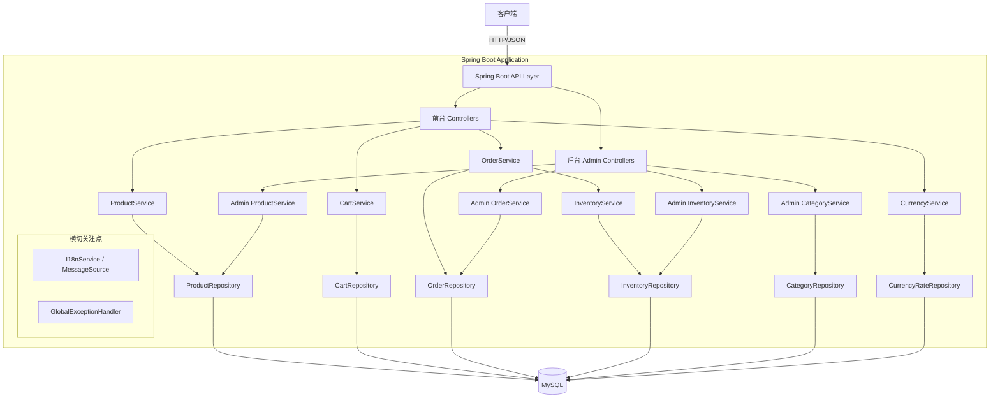
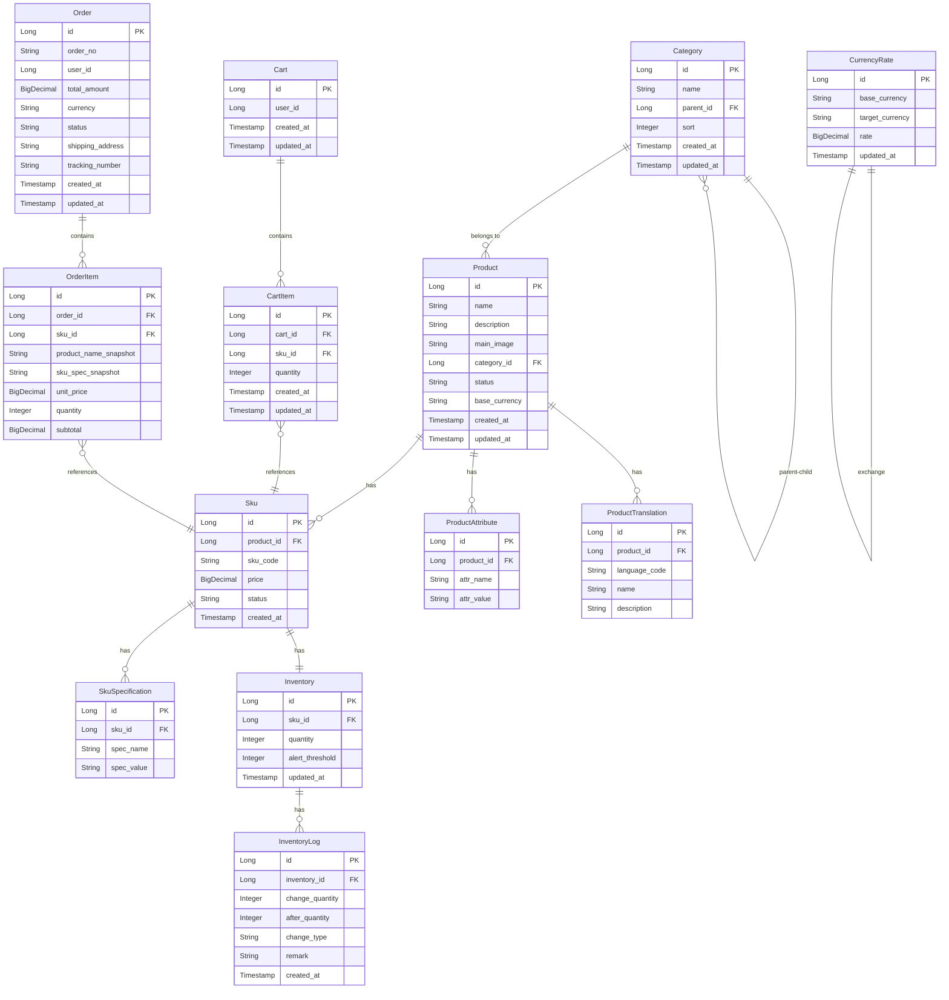
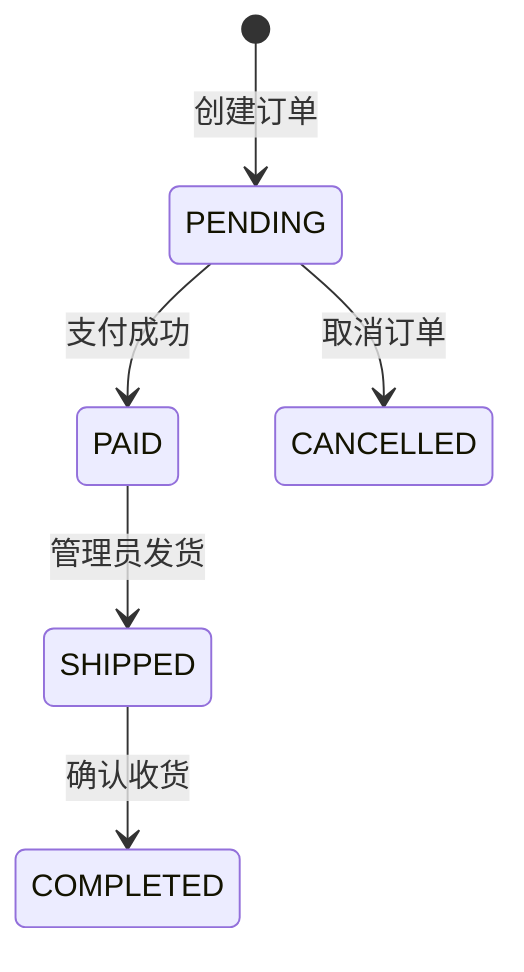

# 设计文档

## 概述

本系统是一套基于 Spring Boot 4.0.2 + Java 17 + MySQL 的电商商城后台系统，提供 RESTful API 服务。系统分为两大模块：

1. **前台 API（/api/v1/）**：面向消费者，提供商品浏览、购物车、下单、货币切换、语言切换等功能
2. **后台管理 API（/api/v1/admin/）**：面向管理员，提供商品、分类、库存、订单的 CRUD 管理

系统采用经典的三层架构（Controller → Service → Repository），使用 Spring Data JPA 操作 MySQL 数据库，Jackson 处理 JSON 序列化/反序列化，Spring MessageSource 实现国际化。

## 架构

### 整体架构图



### 分层说明

| 层级 | 职责 | 技术 |
|------|------|------|
| Controller | 接收 HTTP 请求，参数校验，调用 Service，返回响应 | Spring MVC, Jakarta Validation |
| Service | 业务逻辑处理，事务管理 | Spring Service, @Transactional |
| Repository | 数据访问层 | Spring Data JPA |
| Entity/DTO | 数据模型和传输对象 | JPA Entity, Record/POJO |

### 包结构

```
com.example.javabackenddemo
├── config/                  # 配置类（WebMvc, JPA, I18n）
├── controller/
│   ├── api/                 # 前台 API Controllers
│   └── admin/               # 后台管理 Controllers
├── service/                 # 业务逻辑层
│   └── impl/
├── repository/              # 数据访问层
├── entity/                  # JPA 实体
├── dto/                     # 请求/响应 DTO
│   ├── request/
│   └── response/
├── enums/                   # 枚举类型
├── exception/               # 自定义异常
├── i18n/                    # 国际化相关
└── util/                    # 工具类
```

## 组件与接口

### 前台 API 接口设计

#### 商品接口（ProductController）

| 方法 | 路径 | 功能 | 请求参数 | 响应 |
|------|------|------|----------|------|
| GET | `/api/v1/products` | 分页查询商品列表 | `page`, `size`, `categoryId`, `keyword`, `currency`, `lang` | 分页商品列表 |
| GET | `/api/v1/products/{id}` | 查询商品详情 | `currency`, `lang` | 商品完整信息含 SKU 列表 |
| GET | `/api/v1/products/category/{categoryId}` | 按分类查询商品 | `page`, `size`, `currency`, `lang` | 分页商品列表 |
| GET | `/api/v1/products/search` | 搜索商品 | `keyword`, `page`, `size`, `currency`, `lang` | 分页商品列表 |

#### 分类接口（CategoryController）

| 方法 | 路径 | 功能 | 请求参数 | 响应 |
|------|------|------|----------|------|
| GET | `/api/v1/categories/tree` | 获取分类树 | `lang` | 树形分类结构 |
| GET | `/api/v1/categories/{id}` | 获取分类详情 | `lang` | 分类信息 |

#### 购物车接口（CartController）

| 方法 | 路径 | 功能 | 请求体/参数 | 响应 |
|------|------|------|-------------|------|
| GET | `/api/v1/cart` | 查看购物车 | `currency`, `lang` | 购物车详情含所有 Cart_Item |
| POST | `/api/v1/cart/items` | 添加商品到购物车 | `{ skuId, quantity }` | 更新后的购物车 |
| PUT | `/api/v1/cart/items/{itemId}` | 更新购物车商品数量 | `{ quantity }` | 更新后的购物车 |
| DELETE | `/api/v1/cart/items/{itemId}` | 移除购物车商品 | - | 更新后的购物车 |

#### 订单接口（OrderController）

| 方法 | 路径 | 功能 | 请求体/参数 | 响应 |
|------|------|------|-------------|------|
| POST | `/api/v1/orders` | 创建订单 | `{ shippingAddress, cartItemIds }` | 订单信息 |
| GET | `/api/v1/orders` | 查询订单列表 | `page`, `size`, `status` | 分页订单列表 |
| GET | `/api/v1/orders/{id}` | 查询订单详情 | - | 订单完整信息 |

#### 货币接口（CurrencyController）

| 方法 | 路径 | 功能 | 请求参数 | 响应 |
|------|------|------|----------|------|
| GET | `/api/v1/currencies` | 获取支持的货币列表 | - | 货币代码和名称列表 |
| GET | `/api/v1/currencies/convert` | 价格转换 | `amount`, `from`, `to` | 转换后的金额 |

#### 国际化接口

国际化通过 HTTP 请求头 `Accept-Language` 实现，不需要独立接口。所有 API 响应中的系统消息和错误提示根据该请求头自动切换语言。

### 后台管理 API 接口设计

#### 商品管理（AdminProductController）

| 方法 | 路径 | 功能 | 请求体/参数 | 响应 |
|------|------|------|-------------|------|
| POST | `/api/v1/admin/products` | 创建商品（SPU） | 商品创建 DTO | 创建的商品信息 |
| PUT | `/api/v1/admin/products/{id}` | 更新商品 | 商品更新 DTO | 更新后的商品 |
| DELETE | `/api/v1/admin/products/{id}` | 下架商品（软删除） | - | 操作结果 |
| GET | `/api/v1/admin/products` | 查询商品列表 | `page`, `size`, `name`, `categoryId`, `status` | 分页商品列表 |
| GET | `/api/v1/admin/products/{id}` | 查询商品详情 | - | 商品完整信息 |
| POST | `/api/v1/admin/products/{id}/skus` | 为商品添加 SKU | SKU 创建 DTO | 创建的 SKU 信息 |
| PUT | `/api/v1/admin/products/{id}/skus/{skuId}` | 更新 SKU | SKU 更新 DTO | 更新后的 SKU |
| DELETE | `/api/v1/admin/products/{id}/skus/{skuId}` | 删除 SKU | - | 操作结果 |
| POST | `/api/v1/admin/products/{id}/translations` | 添加商品翻译 | 翻译 DTO | 翻译结果 |

#### 分类管理（AdminCategoryController）

| 方法 | 路径 | 功能 | 请求体/参数 | 响应 |
|------|------|------|-------------|------|
| POST | `/api/v1/admin/categories` | 创建分类 | `{ name, parentId, sort }` | 创建的分类 |
| PUT | `/api/v1/admin/categories/{id}` | 更新分类 | `{ name, sort }` | 更新后的分类 |
| DELETE | `/api/v1/admin/categories/{id}` | 删除分类 | - | 操作结果 |
| GET | `/api/v1/admin/categories` | 查询分类列表 | - | 分类树 |

#### 库存管理（AdminInventoryController）

| 方法 | 路径 | 功能 | 请求体/参数 | 响应 |
|------|------|------|-------------|------|
| GET | `/api/v1/admin/inventory` | 查询库存列表 | `page`, `size`, `lowStock` | 分页库存列表 |
| PUT | `/api/v1/admin/inventory/{skuId}` | 设置 SKU 库存 | `{ quantity, alertThreshold }` | 更新后的库存 |
| GET | `/api/v1/admin/inventory/{skuId}/logs` | 查询库存变更日志 | `page`, `size` | 分页日志列表 |

#### 订单管理（AdminOrderController）

| 方法 | 路径 | 功能 | 请求体/参数 | 响应 |
|------|------|------|-------------|------|
| GET | `/api/v1/admin/orders` | 查询订单列表 | `page`, `size`, `status`, `startDate`, `endDate`, `orderNo` | 分页订单列表 |
| GET | `/api/v1/admin/orders/{id}` | 查询订单详情 | - | 订单完整信息 |
| PUT | `/api/v1/admin/orders/{id}/status` | 更新订单状态 | `{ status, trackingNumber }` | 更新后的订单 |

#### 货币汇率管理（AdminCurrencyController）

| 方法 | 路径 | 功能 | 请求体/参数 | 响应 |
|------|------|------|-------------|------|
| GET | `/api/v1/admin/currencies/rates` | 查询汇率列表 | - | 汇率列表 |
| PUT | `/api/v1/admin/currencies/rates` | 更新汇率 | `{ baseCurrency, rates: [{currency, rate}] }` | 更新结果 |


## 数据模型

### ER 关系图



### 数据表详细设计

#### 1. category（商品分类表）

| 字段 | 类型 | 约束 | 说明 |
|------|------|------|------|
| id | BIGINT | PK, AUTO_INCREMENT | 主键 |
| name | VARCHAR(100) | NOT NULL | 分类名称 |
| parent_id | BIGINT | FK, NULLABLE | 父分类ID，NULL表示顶级分类 |
| sort | INT | DEFAULT 0 | 排序值，越小越靠前 |
| created_at | TIMESTAMP | NOT NULL | 创建时间 |
| updated_at | TIMESTAMP | NOT NULL | 更新时间 |

唯一约束：`UNIQUE(name, parent_id)` — 同级分类名称不可重复

#### 2. product（商品SPU表）

| 字段 | 类型 | 约束 | 说明 |
|------|------|------|------|
| id | BIGINT | PK, AUTO_INCREMENT | 主键 |
| name | VARCHAR(200) | NOT NULL | 商品名称（默认语言） |
| description | TEXT | NULLABLE | 商品描述（默认语言） |
| main_image | VARCHAR(500) | NULLABLE | 主图URL |
| category_id | BIGINT | FK, NOT NULL | 所属分类ID |
| status | VARCHAR(20) | NOT NULL, DEFAULT 'ACTIVE' | 状态：ACTIVE/INACTIVE |
| base_currency | VARCHAR(3) | NOT NULL, DEFAULT 'CNY' | 基准货币代码 |
| created_at | TIMESTAMP | NOT NULL | 创建时间 |
| updated_at | TIMESTAMP | NOT NULL | 更新时间 |

#### 3. product_attribute（商品属性表）

| 字段 | 类型 | 约束 | 说明 |
|------|------|------|------|
| id | BIGINT | PK, AUTO_INCREMENT | 主键 |
| product_id | BIGINT | FK, NOT NULL | 商品ID |
| attr_name | VARCHAR(50) | NOT NULL | 属性名（如"材质"） |
| attr_value | VARCHAR(200) | NOT NULL | 属性值（如"纯棉"） |

#### 4. product_translation（商品翻译表）

| 字段 | 类型 | 约束 | 说明 |
|------|------|------|------|
| id | BIGINT | PK, AUTO_INCREMENT | 主键 |
| product_id | BIGINT | FK, NOT NULL | 商品ID |
| language_code | VARCHAR(5) | NOT NULL | 语言代码（zh/en） |
| name | VARCHAR(200) | NOT NULL | 翻译后的名称 |
| description | TEXT | NULLABLE | 翻译后的描述 |

唯一约束：`UNIQUE(product_id, language_code)`

#### 5. sku（SKU表）

| 字段 | 类型 | 约束 | 说明 |
|------|------|------|------|
| id | BIGINT | PK, AUTO_INCREMENT | 主键 |
| product_id | BIGINT | FK, NOT NULL | 所属商品ID |
| sku_code | VARCHAR(50) | UNIQUE, NOT NULL | SKU编码 |
| price | DECIMAL(12,2) | NOT NULL | 价格（基准货币） |
| status | VARCHAR(20) | NOT NULL, DEFAULT 'ACTIVE' | 状态 |
| created_at | TIMESTAMP | NOT NULL | 创建时间 |

#### 6. sku_specification（SKU规格表）

| 字段 | 类型 | 约束 | 说明 |
|------|------|------|------|
| id | BIGINT | PK, AUTO_INCREMENT | 主键 |
| sku_id | BIGINT | FK, NOT NULL | SKU ID |
| spec_name | VARCHAR(50) | NOT NULL | 规格名（如"颜色"） |
| spec_value | VARCHAR(100) | NOT NULL | 规格值（如"红色"） |

#### 7. inventory（库存表）

| 字段 | 类型 | 约束 | 说明 |
|------|------|------|------|
| id | BIGINT | PK, AUTO_INCREMENT | 主键 |
| sku_id | BIGINT | FK, UNIQUE, NOT NULL | SKU ID（一对一） |
| quantity | INT | NOT NULL, DEFAULT 0 | 当前库存数量 |
| alert_threshold | INT | NOT NULL, DEFAULT 10 | 低库存预警阈值 |
| updated_at | TIMESTAMP | NOT NULL | 最后更新时间 |

#### 8. inventory_log（库存变更日志表）

| 字段 | 类型 | 约束 | 说明 |
|------|------|------|------|
| id | BIGINT | PK, AUTO_INCREMENT | 主键 |
| inventory_id | BIGINT | FK, NOT NULL | 库存记录ID |
| change_quantity | INT | NOT NULL | 变更数量（正数增加，负数减少） |
| after_quantity | INT | NOT NULL | 变更后数量 |
| change_type | VARCHAR(20) | NOT NULL | 变更类型：MANUAL_SET/ORDER_DEDUCT/ORDER_CANCEL |
| remark | VARCHAR(200) | NULLABLE | 备注 |
| created_at | TIMESTAMP | NOT NULL | 变更时间 |

#### 9. cart（购物车表）

| 字段 | 类型 | 约束 | 说明 |
|------|------|------|------|
| id | BIGINT | PK, AUTO_INCREMENT | 主键 |
| user_id | BIGINT | NOT NULL, UNIQUE | 用户ID（一个用户一个购物车） |
| created_at | TIMESTAMP | NOT NULL | 创建时间 |
| updated_at | TIMESTAMP | NOT NULL | 更新时间 |

#### 10. cart_item（购物车商品条目表）

| 字段 | 类型 | 约束 | 说明 |
|------|------|------|------|
| id | BIGINT | PK, AUTO_INCREMENT | 主键 |
| cart_id | BIGINT | FK, NOT NULL | 购物车ID |
| sku_id | BIGINT | FK, NOT NULL | SKU ID |
| quantity | INT | NOT NULL | 数量（必须大于0） |
| created_at | TIMESTAMP | NOT NULL | 添加时间 |
| updated_at | TIMESTAMP | NOT NULL | 更新时间 |

唯一约束：`UNIQUE(cart_id, sku_id)` — 同一购物车中同一 SKU 只有一条记录

#### 11. orders（订单表）

| 字段 | 类型 | 约束 | 说明 |
|------|------|------|------|
| id | BIGINT | PK, AUTO_INCREMENT | 主键 |
| order_no | VARCHAR(32) | UNIQUE, NOT NULL | 订单号 |
| user_id | BIGINT | NOT NULL | 用户ID |
| total_amount | DECIMAL(12,2) | NOT NULL | 订单总金额 |
| currency | VARCHAR(3) | NOT NULL | 结算货币 |
| status | VARCHAR(20) | NOT NULL | 订单状态 |
| shipping_address | TEXT | NOT NULL | 收货地址（JSON格式） |
| tracking_number | VARCHAR(50) | NULLABLE | 物流单号 |
| created_at | TIMESTAMP | NOT NULL | 创建时间 |
| updated_at | TIMESTAMP | NOT NULL | 更新时间 |

订单状态流转：`PENDING → PAID → SHIPPED → COMPLETED`，`PENDING → CANCELLED`

#### 12. order_item（订单商品条目表）

| 字段 | 类型 | 约束 | 说明 |
|------|------|------|------|
| id | BIGINT | PK, AUTO_INCREMENT | 主键 |
| order_id | BIGINT | FK, NOT NULL | 订单ID |
| sku_id | BIGINT | FK, NOT NULL | SKU ID |
| product_name_snapshot | VARCHAR(200) | NOT NULL | 下单时商品名称快照 |
| sku_spec_snapshot | VARCHAR(500) | NOT NULL | 下单时规格快照（JSON） |
| unit_price | DECIMAL(12,2) | NOT NULL | 下单时单价 |
| quantity | INT | NOT NULL | 数量 |
| subtotal | DECIMAL(12,2) | NOT NULL | 小计金额 |

#### 13. currency_rate（汇率表）

| 字段 | 类型 | 约束 | 说明 |
|------|------|------|------|
| id | BIGINT | PK, AUTO_INCREMENT | 主键 |
| base_currency | VARCHAR(3) | NOT NULL | 基准货币代码 |
| target_currency | VARCHAR(3) | NOT NULL | 目标货币代码 |
| rate | DECIMAL(12,6) | NOT NULL | 汇率 |
| updated_at | TIMESTAMP | NOT NULL | 更新时间 |

唯一约束：`UNIQUE(base_currency, target_currency)`

### 订单状态机



合法状态转换表：

| 当前状态 | 允许转换到 |
|----------|-----------|
| PENDING | PAID, CANCELLED |
| PAID | SHIPPED |
| SHIPPED | COMPLETED |
| COMPLETED | （终态） |
| CANCELLED | （终态） |

### 关键 DTO 设计

#### 统一响应格式

```java
public record ApiResponse<T>(
    int code,
    String message,
    T data
) {}
```

#### 分页响应格式

```java
public record PageResponse<T>(
    List<T> content,
    int page,
    int size,
    long totalElements,
    int totalPages
) {}
```

#### 商品列表响应

```java
public record ProductListItemResponse(
    Long id,
    String name,
    String mainImage,
    BigDecimal price,
    String currency
) {}
```

#### 商品详情响应

```java
public record ProductDetailResponse(
    Long id,
    String name,
    String description,
    String mainImage,
    Long categoryId,
    String categoryName,
    List<AttributeResponse> attributes,
    List<SkuResponse> skus,
    String currency
) {}

public record SkuResponse(
    Long id,
    String skuCode,
    BigDecimal price,
    List<SpecificationResponse> specifications,
    Integer stockQuantity,
    boolean inStock
) {}
```

#### 购物车响应

```java
public record CartResponse(
    Long id,
    List<CartItemResponse> items,
    BigDecimal totalAmount,
    String currency
) {}

public record CartItemResponse(
    Long id,
    Long skuId,
    String productName,
    String mainImage,
    String specifications,
    BigDecimal unitPrice,
    Integer quantity,
    BigDecimal subtotal
) {}
```

#### 订单创建请求

```java
public record CreateOrderRequest(
    @NotBlank String shippingAddress,
    List<Long> cartItemIds
) {}
```

#### 订单响应

```java
public record OrderResponse(
    Long id,
    String orderNo,
    BigDecimal totalAmount,
    String currency,
    String status,
    String shippingAddress,
    String trackingNumber,
    List<OrderItemResponse> items,
    LocalDateTime createdAt
) {}
```

## 正确性属性

*属性（Property）是一种在系统所有有效执行中都应成立的特征或行为——本质上是关于系统应该做什么的形式化陈述。属性是人类可读规范与机器可验证正确性保证之间的桥梁。*

### Property 1: 分类过滤正确性

*For any* 分类树和商品集合，按某个分类查询返回的所有商品都应属于该分类或其子分类，且不遗漏任何属于该分类及子分类的商品。

**Validates: Requirements 1.3**

### Property 2: 关键词搜索正确性

*For any* 关键词和商品集合，搜索返回的所有商品的名称或描述中都应包含该关键词。

**Validates: Requirements 1.4**

### Property 3: 商品详情完整性

*For any* 有效商品（含多个SKU），查询详情返回的响应应包含图片列表、名称、描述、价格、所有SKU的规格组合及各自的价格和库存状态。

**Validates: Requirements 1.2, 1.5**

### Property 4: 分类树结构正确性

*For any* 分类数据集，返回的分类树中每个节点的子节点的 parent_id 都应等于该节点的 id，且所有分类都出现在树中。

**Validates: Requirements 2.1**

### Property 5: 同级分类唯一性

*For any* 父分类，在该父分类下创建两个同名分类，第二次创建应被拒绝。

**Validates: Requirements 2.5**

### Property 6: 有商品分类删除保护

*For any* 关联了商品的分类，删除操作应被拒绝并返回错误。

**Validates: Requirements 2.4**

### Property 7: 购物车SKU唯一性与数量累加

*For any* SKU 和购物车，无论添加多少次，购物车中该 SKU 的记录数始终为 1，且数量等于所有添加操作的数量之和。

**Validates: Requirements 3.1, 3.2**

### Property 8: 购物车库存校验

*For any* SKU，当添加到购物车的数量超过该 SKU 的可用库存时，添加操作应被拒绝。

**Validates: Requirements 3.6**

### Property 9: 购物车查看完整性

*For any* 购物车状态，查看购物车返回的每个 Cart_Item 都应包含商品名称、图片、规格、单价、数量和小计金额，且小计金额等于单价乘以数量。

**Validates: Requirements 3.5**

### Property 10: 订单创建与库存扣减一致性

*For any* 有效的订单创建操作，创建后每个相关 SKU 的库存减少量应等于订单中该 SKU 的购买数量。

**Validates: Requirements 4.1, 4.2**

### Property 11: 订单创建后购物车清空

*For any* 成功创建的订单，订单中包含的所有 Cart_Item 应从购物车中移除。

**Validates: Requirements 4.3**

### Property 12: 库存不足拒绝下单

*For any* SKU，当其库存不足以满足订单需求时，订单创建应失败并返回库存不足的具体 SKU 信息。

**Validates: Requirements 4.4**

### Property 13: 订单状态转换合法性

*For any* 订单状态和目标状态，当且仅当该转换在合法状态转换表中时，状态更新才应成功；否则应被拒绝。

**Validates: Requirements 4.7, 4.8**

### Property 14: 订单查询完整性

*For any* 用户的订单，查询订单列表应返回该用户的所有订单（含订单号、状态、总金额、创建时间），查询详情应返回完整信息（含商品快照、数量、单价、收货地址、状态）。

**Validates: Requirements 4.5, 4.6**

### Property 15: 库存设置与日志记录

*For any* SKU 库存设置操作，操作后库存数量应等于设置值，且应存在一条变更日志记录包含变更前后数量。

**Validates: Requirements 5.2**

### Property 16: 低库存标记正确性

*For any* SKU，当其库存数量低于预警阈值时，库存查询结果中该 SKU 应被标记为低库存状态；当库存数量大于等于阈值时，不应被标记。

**Validates: Requirements 5.3, 5.4**

### Property 17: 库存非负约束

*For any* 库存扣减操作，如果扣减后库存数量为负数，该操作应被拒绝。

**Validates: Requirements 5.5**

### Property 18: 货币转换正确性

*For any* 商品价格、基准货币和目标货币，转换后的价格应等于原价乘以对应汇率（在合理精度范围内）。

**Validates: Requirements 6.1, 6.4**

### Property 19: 不支持货币拒绝

*For any* 不在系统支持列表中的货币代码，货币转换操作应返回不支持的货币错误。

**Validates: Requirements 6.5**

### Property 20: 国际化内容返回

*For any* 支持的语言代码和有对应翻译的商品，查询应返回该语言版本的名称和描述；系统提示信息也应使用该语言。

**Validates: Requirements 7.1, 7.2**

### Property 21: 国际化回退

*For any* 不存在翻译的语言请求，系统应回退到默认语言（中文）返回内容。

**Validates: Requirements 7.3**

### Property 22: 商品软删除

*For any* 被管理员删除的商品，该商品的状态应变为 INACTIVE 而非被物理删除，数据库中仍可查询到该记录。

**Validates: Requirements 8.4**

### Property 23: 商品筛选正确性

*For any* 筛选条件组合（名称、分类、状态），管理员查询返回的所有商品都应满足所有指定的筛选条件。

**Validates: Requirements 8.5**

### Property 24: 必填字段校验

*For any* 缺少必填字段的商品创建请求，系统应返回字段校验错误的详细信息。

**Validates: Requirements 8.6**

### Property 25: JSON 往返一致性

*For any* 有效的商品对象、订单对象或购物车对象，序列化为 JSON 再反序列化应产生等价的对象。

**Validates: Requirements 10.2, 10.3, 10.4**

## 错误处理

### 全局异常处理

系统使用 `@RestControllerAdvice` 实现全局异常处理，统一错误响应格式：

```java
public record ErrorResponse(
    int code,
    String message,
    Map<String, String> fieldErrors  // 字段校验错误时使用
) {}
```

### 异常类型与HTTP状态码映射

| 异常类型 | HTTP 状态码 | 场景 |
|----------|------------|------|
| ResourceNotFoundException | 404 | 商品/订单/分类不存在 |
| InsufficientStockException | 409 | 库存不足 |
| DuplicateResourceException | 409 | 同名分类重复 |
| InvalidStateTransitionException | 400 | 非法订单状态转换 |
| UnsupportedCurrencyException | 400 | 不支持的货币代码 |
| CategoryHasProductsException | 409 | 分类下有商品无法删除 |
| MethodArgumentNotValidException | 400 | 请求参数校验失败 |
| Exception（兜底） | 500 | 未预期的服务器错误 |

### 错误消息国际化

所有错误消息通过 Spring MessageSource 实现国际化，错误消息 key 定义在 `messages.properties`（中文）和 `messages_en.properties`（英文）中。

## 测试策略

### 测试框架选择

- **单元测试**：JUnit 5 + Mockito
- **属性测试**：jqwik（Java 属性测试库）
- **集成测试**：Spring Boot Test + H2 内存数据库
- **API 测试**：MockMvc

### 属性测试配置

- 使用 jqwik 库（`net.jqwik:jqwik:1.9.1`）
- 每个属性测试最少运行 100 次迭代
- 每个属性测试必须通过注释引用设计文档中的属性编号
- 标签格式：`Feature: ecommerce-backend, Property {number}: {property_text}`

### 测试分层

| 测试类型 | 目标 | 工具 |
|----------|------|------|
| 单元测试 | Service 层业务逻辑、边界条件、错误处理 | JUnit 5 + Mockito |
| 属性测试 | 正确性属性的通用验证 | jqwik |
| 集成测试 | Repository 层数据访问、事务行为 | Spring Boot Test + H2 |
| API 测试 | Controller 层请求/响应、参数校验 | MockMvc |

### 关键测试场景

**单元测试重点**：
- 订单状态机的边界转换
- 购物车数量为零时的移除逻辑
- 货币转换的精度处理
- 国际化回退逻辑

**属性测试重点**：
- 分类过滤正确性（Property 1）
- 购物车 SKU 唯一性（Property 7）
- 订单库存扣减一致性（Property 10）
- 订单状态转换合法性（Property 13）
- 货币转换正确性（Property 18）
- JSON 往返一致性（Property 25）
